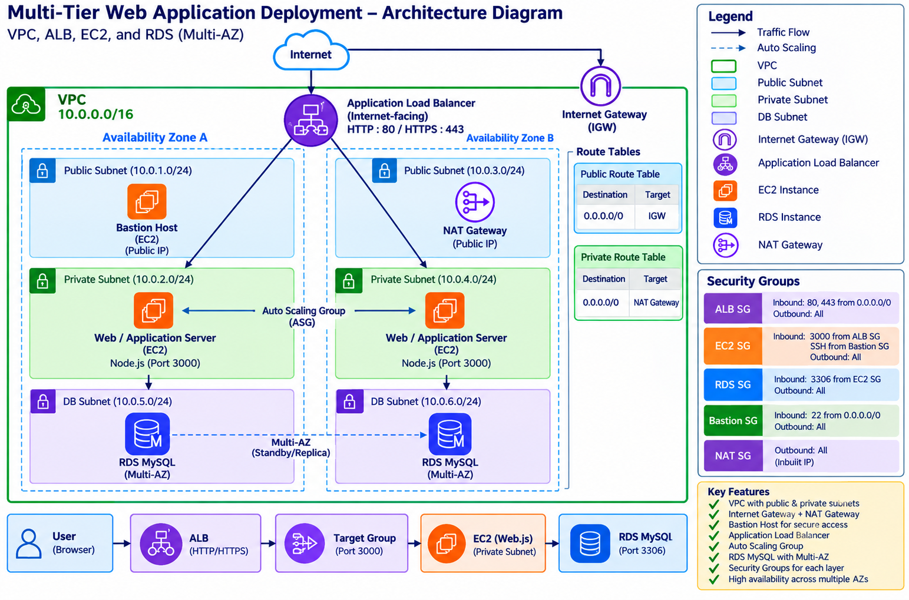

# Multi-Tier Web Application Deployment on AWS

A multi-tier web application deployed on **Amazon Web Services (AWS)** using **Amazon VPC, Public and Private Subnets, Internet Gateway, NAT Gateway, Bastion Host, Application Load Balancer, Amazon EC2, and Amazon RDS MySQL**.

This project demonstrates network segmentation, secure application deployment, database connectivity, load balancing, and scalable cloud architecture.

---

## Table of Contents

* [Project Overview](#project-overview)
* [Architecture](#architecture)
* [Deployment Workflow](#deployment-workflow)
* [AWS Services Used](#aws-services-used)
* [Repository Structure](#repository-structure)
* [Deployment Summary](#deployment-summary)
* [Application Deployment](#application-deployment)
* [Database Configuration](#database-configuration)
* [Security Configuration](#security-configuration)
* [Testing](#testing)
* [Key Learning Outcomes](#key-learning-outcomes)
* [Skills Demonstrated](#skills-demonstrated)
* [Future Scope](#future-scope)
* [Documentation](#documentation)
* [Author](#author)

---

# Project Overview

The objective of this project is to deploy a **Node.js web application on AWS using a secure multi-tier architecture**.

The infrastructure separates application components into different network layers using **public and private subnets**.

The deployment includes:

* Amazon VPC
* Public and Private Subnets
* Internet Gateway
* NAT Gateway
* Route Tables
* Bastion Host
* Amazon EC2
* Application Load Balancer
* Target Group
* Amazon RDS MySQL
* Security Groups
* Network ACLs
* Auto Scaling

The application is deployed on a private EC2 instance, while the Application Load Balancer acts as the public entry point. The database is hosted using Amazon RDS MySQL in the private layer.

---

# Architecture

The project follows a **multi-tier AWS architecture** consisting of a public-facing load balancing layer, a private application layer, and a private database layer.

### Architecture Image
[](./Architecture.png)

### Architecture Flow

```text
                         INTERNET
                            │
                            ▼
                 ┌─────────────────────┐
                 │         ALB         │
                 │    Public Subnet    │
                 └──────────┬──────────┘
                            │
                            ▼
                 ┌─────────────────────┐
                 │    EC2 / Node.js    │
                 │   Private Subnet    │
                 └──────────┬──────────┘
                            │
                       MySQL : 3306
                            │
                            ▼
                 ┌─────────────────────┐
                 │      RDS MySQL      │
                 │   Private Subnet    │
                 └─────────────────────┘
```

### Additional Infrastructure

```text
                 ┌─────────────────────┐
                 │      AWS VPC        │
                 │                     │
                 │  Public Subnet      │
                 │  ├── ALB            │
                 │  └── Bastion Host   │
                 │                     │
                 │  Private Subnet     │
                 │  ├── EC2            │
                 │  └── RDS            │
                 └─────────────────────┘
```

The architecture uses a **Bastion Host** for secure administrative access and a **NAT Gateway** to provide outbound internet connectivity to private resources.

---

# Deployment Workflow

The complete deployment workflow is:

```text
Developer / Internet User
          │
          ▼
Application Load Balancer
          │
          ▼
Target Group
          │
          ▼
Private EC2 Instance
          │
          ▼
Node.js Web Application
          │
          ▼
Amazon RDS MySQL
```

For administrative access:

```text
Administrator
     │
     ▼
Bastion Host
     │
     ▼
Private EC2
```

For private-subnet outbound connectivity:

```text
Private EC2
     │
     ▼
NAT Gateway
     │
     ▼
Internet Gateway
     │
     ▼
Internet
```

---

# AWS Services Used

| **Service**                   | **Purpose**                                            |
| ----------------------------- | ------------------------------------------------------ |
| **Amazon VPC**                | Creates the isolated AWS network                       |
| **Subnets**                   | Separates public and private resources                 |
| **Internet Gateway**          | Provides internet connectivity                         |
| **NAT Gateway**               | Provides outbound internet access to private resources |
| **Route Tables**              | Controls network traffic routing                       |
| **Amazon EC2**                | Hosts the Node.js application                          |
| **Application Load Balancer** | Distributes incoming application traffic               |
| **Target Group**              | Contains and monitors EC2 targets                      |
| **Amazon RDS**                | Hosts the MySQL database                               |
| **Security Groups**           | Controls resource-level access                         |
| **Network ACL**               | Provides subnet-level network filtering                |
| **Auto Scaling**              | Supports dynamic application scaling                   |

---

# Repository Structure

```text
project-6-multi-tier-aws
│
├── README.md
│
├── docs/
│   ├── THEORY.md
│   ├── IMPLEMENTATION.md
│   └── architecture-diagram.png
│
├── screenshots/
│   ├── vpc/
│   ├── subnets/
│   ├── route-tables/
│   ├── nat-gateway/
│   ├── ec2/
│   ├── rds/
│   ├── security-groups/
│   ├── load-balancer/
│   └── testing/
│
└── application/
    └── README.md
```

---

# Deployment Summary

The deployment process consists of the following high-level steps:

1. Create an Amazon VPC.
2. Create public and private subnets.
3. Configure the Internet Gateway.
4. Configure route tables.
5. Create and configure the NAT Gateway.
6. Configure the Bastion Host.
7. Launch the private EC2 instance.
8. Create the Amazon RDS MySQL instance.
9. Test RDS connectivity.
10. Deploy the Node.js application.
11. Create the Application Load Balancer.
12. Configure the Target Group.
13. Configure health checks.
14. Configure Security Groups.
15. Test the application through the ALB.
16. Configure scaling.

---

# Application Deployment

The application used in this project is a **Node.js web application**.

The application is deployed on an **EC2 instance located in the private subnet**.

### Application Flow

```text
GitHub Repository
       │
       ▼
Private EC2 Instance
       │
       ▼
Node.js Application
       │
       ▼
Application Load Balancer
       │
       ▼
Internet Users
```

The Application Load Balancer provides controlled access to the application while keeping the application server inside the private subnet.

---

# Database Configuration

The project uses **Amazon RDS MySQL** as the database layer.

```text
Application EC2
      │
      │ MySQL : 3306
      ▼
Amazon RDS MySQL
```

The RDS instance is deployed privately and is accessible from the application layer through the configured Security Group rules.

---

# Security Configuration

Security is implemented using multiple layers.

## Application Load Balancer

The Application Load Balancer receives incoming application traffic.

```text
Internet
   │
   ├── HTTP : 80
   │
   └── HTTPS : 443
   │
   ▼
Application Load Balancer
```

---

## EC2 Security

The application EC2 instance accepts application traffic from the Application Load Balancer instead of directly from the public internet.

```text
Internet
    │
    ▼
   ALB
    │
    ▼
Private EC2
```

---

## RDS Security

The RDS Security Group allows MySQL traffic from the application EC2 Security Group.

```text
EC2 Security Group
        │
        │ TCP : 3306
        ▼
    RDS MySQL
```

---

## Bastion Host

Administrative SSH access follows:

```text
Administrator
      │
      ▼
Bastion Host
      │
      ▼
Private EC2
```

The Bastion Host provides a controlled method of accessing the private EC2 instance for administration.

---

# Testing

The following components were tested during the deployment:

* VPC connectivity
* Private EC2 connectivity
* Bastion Host SSH access
* RDS connectivity
* MySQL connection
* Node.js application
* Application Load Balancer connectivity
* Target Group health checks
* Application through ALB DNS
* Security Group rules

The application can be accessed through the **ALB DNS name** after successful configuration.

---

# Key Learning Outcomes

Through this project, the following concepts were implemented and understood:

* Designing a VPC-based cloud architecture
* Understanding public and private subnet configuration
* Routing using route tables
* Internet Gateway and NAT Gateway
* Secure access through a Bastion Host
* Deploying applications on EC2
* Connecting EC2 applications with RDS
* Configuring MySQL database connectivity
* Using Application Load Balancer
* Configuring Target Groups and health checks
* Implementing Security Groups
* Understanding Network ACLs
* Designing for scalability and availability
* Understanding multi-tier cloud architecture

---

# Skills Demonstrated

* AWS VPC
* Public & Private Subnets
* Internet Gateway
* NAT Gateway
* Route Tables
* Amazon EC2
* Amazon RDS
* MySQL
* Application Load Balancer
* Target Groups
* Security Groups
* Network ACLs
* Bastion Host
* Node.js
* Linux
* Cloud Networking
* Multi-Tier Architecture
* Load Balancing
* Database Connectivity
* Cloud Deployment

---

# Future Scope

The project can be further extended by implementing:

* CI/CD pipelines
* Infrastructure as Code
* Automated deployments
* Auto Scaling policies
* HTTPS using SSL/TLS certificates
* Amazon CloudWatch monitoring
* Centralized logging
* High-availability deployment across multiple Availability Zones

> The current project focuses on understanding the core AWS networking, compute, database, security, and load-balancing components.

---

# Documentation

Detailed project documentation can be maintained in the `docs/` directory.

### Documentation Files

* **[Theory Notes](https://docs.google.com/document/d/1AU9PN1aQwrPAfnRJjzFhGcL-ssbrzYCg-kJRC1hWcRk/edit?usp=sharing)**
* **[Implementation Guide](https://docs.google.com/document/d/1AU9PN1aQwrPAfnRJjzFhGcL-ssbrzYCg-kJRC1hWcRk/edit?usp=sharing)**
* **[Architecture Diagram](https://docs.google.com/document/d/1AU9PN1aQwrPAfnRJjzFhGcL-ssbrzYCg-kJRC1hWcRk/edit?usp=sharing)**

The theory covers:

* Multi-Tier Architecture
* VPC
* Public and Private Subnets
* Internet Gateway
* NAT Gateway
* Route Tables
* Bastion Host
* EC2
* Application Load Balancer
* Target Groups
* Health Checks
* Amazon RDS
* Security Groups
* Network ACLs
* Auto Scaling
* High Availability

---

# Author

**Aditi Narang**

**Technology Stack:** AWS + Node.js + MySQL

**Architecture:** VPC + ALB + EC2 + RDS
